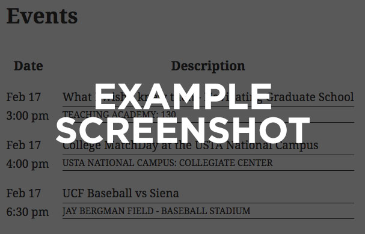

The {{My Project}} utilizes a unique layout system that makes it easy to customize how {{what?}} are displayed on your site.

All of the layouts listed below are available with this plugin out-of-the-box.  With a little bit of custom code in your theme's functions.php file (or another plugin), you can change a certain part of how something is displayed, or create a totally custom layout.

## Navigation

- [Included layouts](#included-layouts)
- [Adding or editing an existing layout](#adding-or-editing-an-existing-layout)

-----

## Included layouts

### {{Layout 1}} {{IF LAYOUT IS THE DEFAULT LAYOUT OPTION}}(Default){{ENDIF}}
**Layout slug:** `{{layout_1_slug}}`

{{Description of the layout}}

#### Layout hooks
- `ucf_{{Plugin slug here}}_display_{{layout_1_slug}}_before` {{Add link to Actions and Filters pg docs}})
- `ucf_{{Plugin slug here}}_display_{{layout_1_slug}}_title` {{Add link to Actions and Filters pg docs}})
- `ucf_{{Plugin slug here}}_display_{{layout_1_slug}}` {{Add link to Actions and Filters pg docs}})
- `ucf_{{Plugin slug here}}_display_{{layout_1_slug}}_after` {{Add link to Actions and Filters pg docs}})

{{Edit this list as necessary!}}

#### Examples

- {{Description of screenshot, e.g. "Default layout options"}}:

  

- {{Description of screenshot, e.g. "Layout using some extra option"}}:

  

### {{Layout 2}}
**Layout slug:** `{{layout_2_slug}}`

{{Description of the layout}}

#### Layout hooks
- `ucf_{{Plugin slug here}}_display_{{layout_2_slug}}_before` {{Add link to Actions and Filters pg docs}})
- `ucf_{{Plugin slug here}}_display_{{layout_2_slug}}_title` {{Add link to Actions and Filters pg docs}})
- `ucf_{{Plugin slug here}}_display_{{layout_2_slug}}` {{Add link to Actions and Filters pg docs}})
- `ucf_{{Plugin slug here}}_display_{{layout_2_slug}}_after` {{Add link to Actions and Filters pg docs}})

{{Edit this list as necessary!}}

#### Examples

- {{Description of screenshot, e.g. "Default layout options"}}:

  

- {{Description of screenshot, e.g. "Layout using some extra option"}}:

  

-----

## Adding or editing an existing layout

When you can't accomplish the customizations you need using CSS overrides, editing any of the [existing layouts listed above](#included-layouts) or creating a new layout is as easy as overriding one or more standard [WordPress filters](https://codex.wordpress.org/Plugin_API#Hooks:_Actions_and_Filters).  **Adding or editing layout hooks will require a developer who can edit your theme or custom plugin.**

Layout hooks in this plugin generally{{Remove "generally" if this is accurate for all layout hooks}} follow this naming structure:

`ucf_{{Plugin hook slug}}_display_LAYOUTSLUG_...`

where `LAYOUTSLUG` corresponds to the "layout slug" listed under any of the layouts listed above.

Layout hooks are typically{{Remove "typically" if this is accurate for all layout hooks}} broken out into parts, making it easy to change small chunks of a layout while letting the plugin control the rest.  For instance, {{Include an example here of how a chunk of a layout could be overridden, e.g. "if you want to just override how the mylayout layout's title is displayed, your theme or plugin could hook into `ucf_{{Plugin hook slug}}_display_mylayout_title` and modify what's returned."}}

To view the full list of available layout hooks that can be overridden, check out our [[Actions and Filters docs|Actions and Filters]].

### Adding a new layout

You can create a new layout that utilizes any of the [[layout hooks|Actions and Filters]] provided by this plugin.  By default, all layouts will use the display logic for the {{default/classic layout name}} layout.  Any unique, layout-specific filters you add will be used in favor of the {{default/classic layout name}} layout functions.

Before creating a new layout filter, you should pick a slug for your new layout.  Layout slugs may contain **letters, numbers, and underscores only**.  In the examples below, we'll use the layout slug `mylayout`.

{{If this plugin provides a layout registration function (e.g. to support WP SCIF), add instructions here about registering the layout}}

{{Provide a guide to creating a new layout called "mylayout" for one of the shortcodes/widgets provided by this plugin here.  Use examples!}}
