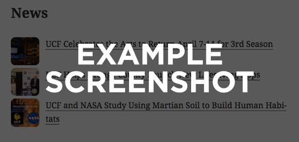

The {{My Project}} utilizes a unique layout system that makes it easy to customize how {{what?}} are displayed on your site.

All of the layouts listed below are available with this plugin out-of-the-box.  With a little bit of custom code in your theme's functions.php file (or another plugin), you can change a certain part of how something is displayed, or create a totally custom layout.

## Navigation

- [Included Layouts](#included-layouts)
- [Adding or Editing Existing Layouts](#adding-or-editing-existing-layouts)

-----

## Included Layouts

### {{Layout 1}}
**Layout slug:** `{{layout-1-slug}}`

{{Description of the layout}}

#### Examples

- {{Description of screenshot, e.g. "Default layout options"}}:

  

- {{Description of screenshot, e.g. "Layout using some extra option"}}:

  

### {{Layout 2}}
**Layout slug:** `{{layout-2-slug}}`

{{Description of the layout}}

#### Examples

- {{Description of screenshot, e.g. "Default layout options"}}:

  

- {{Description of screenshot, e.g. "Layout using some extra option"}}:

  

-----

## Adding or Editing Existing Layouts

TODO
