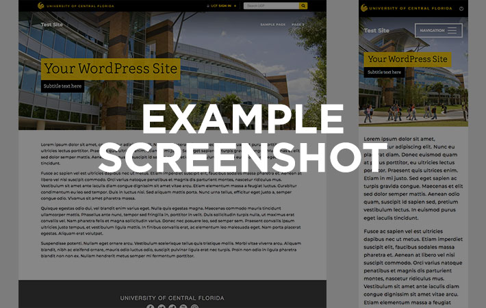

This theme provides the templates listed below, which you can use to style posts, pages, or other custom post types.

## Navigation
- [{{Template 1}}](#{{Template-1}})
- [{{Template 2}}](#{{Template-2}})

{{Add to this list as necessary}}

-----

## {{Template 1}}
**Post types:** Post, Page {{Edit this list as needed}}

{{Update this screenshot!}}

{{Briefly explain what this template looks like and what its best use case scenarios might be; e.g. "This template wraps post content in a narrow, fixed-width container; it is best suited for text-heavy content, such as news articles or blog posts."}}

{{Include any other notable information about this template here--e.g., is it dependent on a custom post type plugin being installed?  Does content hide or rearrange in a unique way on mobile devices?}}

-----

## {{Template 2}}
**Post types:** Post, Page {{Edit this list as needed}}

{{Update this screenshot!}}

{{Briefly explain what this template looks like and what its best use case scenarios might be; e.g. "This template wraps post content in a narrow, fixed-width container; it is best suited for text-heavy content, such as news articles or blog posts."}}

{{Include any other notable information about this template here--e.g., is it dependent on a custom post type plugin being installed?  Does content hide or rearrange in a unique way on mobile devices?}}

-----

{{Add more template information for every template provided in this theme.}}
